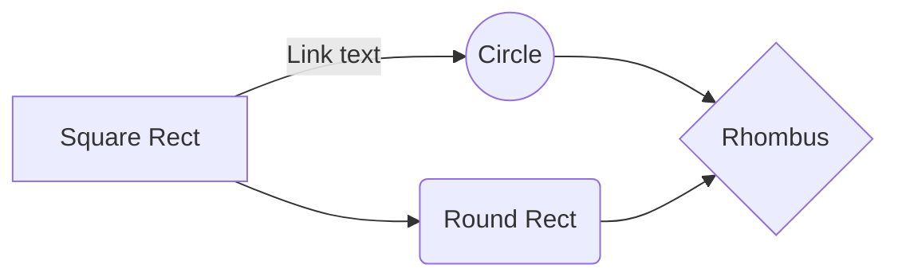

# Ejercicio 1
#### A)
* Fetch
	* Control Unit -> Micro PC -> Ve micoinstrucciones en ROM
	* PC -> Registro de posicion actual en memoria
	* Memoria -> Recibe de PC direccion a la que hay que aceder y desde donde se cargan las instrucciones al Decode

* Decode 
	* Decode -> Recibe instrucciones y decondifica operandos
	* PC -> Al finalizar esta parte del ciclo, se incrementa en 1
	* Memoria -> Decode puede pedir palabras extras
	* Control Unit -> Habilita las seniales para cargar/leer en cada componente y resuelve los saltos condicionales.

* Execute
	* Control Unit
		* Decodificadas las instrucciones, se van cargando en el microPC y se ejecutan

#### B)

Antes de cada Fetch || Luego de Execute:
* Si no hay interrupcion, Fetch a proxima instruccion
* Si hay interrupcion pendiente
	* Suspender ejecucion del programa corriendo
	* Salvar contexto
	* Hacer que PC apunte a direccion de rutina de int
	* Procesar y restaurar contexto

#### C)
ROM que forma parte de Control-Unit

#### E)
Se define segun la arquitectura y la forma en la que fue codificada en MicroCode.ops

#### F) 
Los saltos condicionales se resuelven en la Control-Unit segun el estado de los flags actuales. En la microPC a traves de la entrada Data(D) se puede ingresar la direccion a la que se desea saltar, segun se activen las seniales de JC, JZ o JN.

# Ejercicio 2
Si vale siempre 0 o esta cortado: No funcionaria ninguna rutina de interrupcion.

Si vale siempre 1: Una vez se atiende una interrupcion, se entraria en un bucle infinito pues se forzaria siempre a ir a la direccion de su rutina de interrupcion.

# Ejercicio 3

#### A)
__Fetch__:
ALU_OP=cte0xff ALU_opW			; Cargo posicion 0xff que sirve de SP
ALU_enOut MM_enAddr					; Accedo a memoria 0xff para guardar PC
PC_enOut MM_load							; Guardo PC en 0xff
IC_cli													; Coloco I=0 para evitar otra int
ALU_OP=cte0x00 ALU_opW			; Cargo posicion 0x00 para ver rutina int
ALU_enOut MM_enAddr				    ; Accedo a posicion de memoria 0x00
MM_enOut PC_load							; Cargo dir de rutina int en PC
IC_inta												; Activo senial inta del IC
reset_microOp

#### B)
__STI__:
IC_sti ; I := 1

__CLI__:
IC_cli ; I := 0

#### C)
__IRET__:
ALU_OP=cte0xff ALU_opW			; Cargo posicion 0xff (SP) donde guarde PC
ALU_enOut MM_enAddr					; Accedo a memoria 0xff
MM_enOut PC_load							; Reestablesco contenido de PC
IC_sti 													; I := Vuelve a habilitar int

# Ejercicio 4

#### A)

R1 := 0x03
R2 := 0x00
R3 := &rai
[0x00] := &rai
STI

__loop__:
CMP R1, R2 // 3-0 no cambia flags
if Z:
	PC := &fin // No pasa
	JMP &loop

__Fin__: 
CLI

__halt__:
JMP &halt

__rai__:
*R1--
IRET

#### B)
Se necesitan por lo menos 3 interrupciones para que se llegue a activar el flag Z en loop (lo que produce un break)

#### C)
Si se reciben mas de 3 interrupciones antes de que se llegue a evaluar CMP, no va a estar prendiendo el flag Z, pues la resta daria un numero negativo y entonces no se sale del bucle.

#### D)
Hay un escenario donde habria un problema
1. Si luego de CMP estoy justo en R1 := 1, al interrumpirse no se va a actualizar el flag aunque R1 pasa a contener 0. Si antes de volver a llamarse el proximo CMP se realiza otra interrupcion, pasaria __B__. 
El resto no seria problema, particularmente el caso de que ya se haya hecho la 3ra interrupcion y se de una 4ta interrupcion entre CMP y JZ, el flag Z no se actualizaria, seguiria estando prendiendo y se saldria del bucle.

# Ejercicio 5

__velocidad__: 
SET R0, 0x00		; En R0 guardo vel actual, por defecto detenido

__dispositivo__:
LOAD R1, [0xF0]		; Lecturas periodicas
CMP R1, 0x00			
JZ frenar						; Si lee 0, frena tren
CMP R1, 0x02
JZ vel_max					; Si ahora lee 0, era 2 -> Velocidad maxima
JN vel_curva				; Si ahora lee -1, era 1 -> Velocidad curva
JUMP dispositivo		; Volver a leer

__vel_max__:
SET R0, 0x02		; Habilito tren para que vaya a velocidad maxima
JUMP dispositivo		; Vuelvo a leer dispositivo
__vel_min__:
SET R0, 0x01		; Habilito tren para que vaya a velocidad curva
JUMP dispositivo		; Vuelvo a leer dispositivo

__rai_curva__:
CLI			; No me interesa que advierta sobre otra curva proxima
SET R2, 0x01
STR [0xF0], R2		; Guardo senial de curva proxima para que disp lea
IRET						; Reestablezco PC, podria hacerlo saltar a dispositivo directamente?

__rai_fin_curva__:
; No uso CLI porque quizas se detecte curva proxima al salir de ultima curva
SET R2; 0x02
STR [0xF0], R2		; Guardo senial de fin de curva, y velocidad maxima para disp
IRET						; Reestablezco PC, podria hacerlo saltar a dipositivo directamente?

Podria directamente usar STI y JUMP dispositivo en vez de IRET, ya que no se alteran los flags con SET o STR, y en ambos casos me interesa que se vuelva a hacer una lectura inmediata luego de la rutina de interrupcion.

